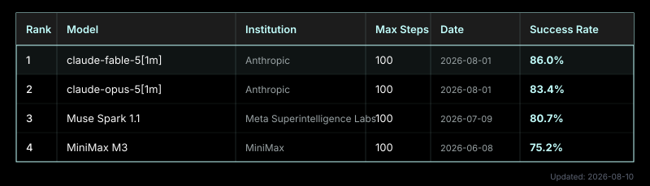

# osworld-leaderboard-updater

Updates the OSWorld benchmark leaderboard as an SVG for GitHub README embedding.



## Usage

```bash
cargo run --release -p osworld-leaderboard
cargo run --release -p osworld-leaderboard -- --output path/to/output.svg
```

The GitHub Action runs weekly (every Monday) and commits any changes automatically.
